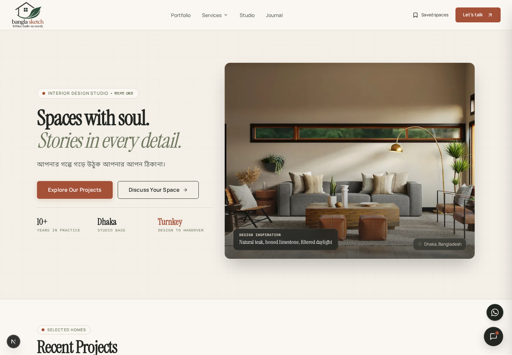
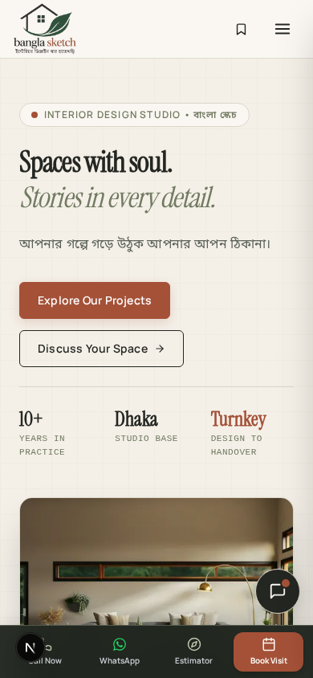
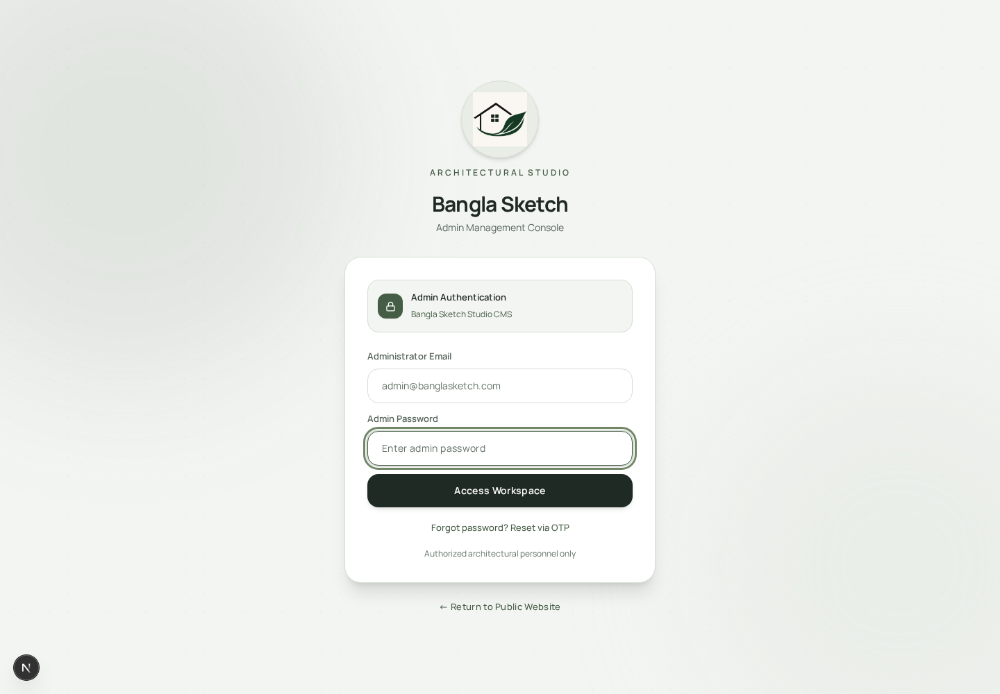
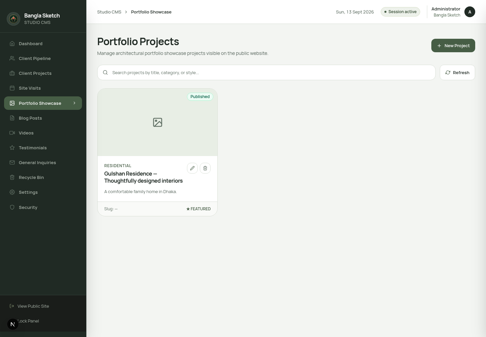
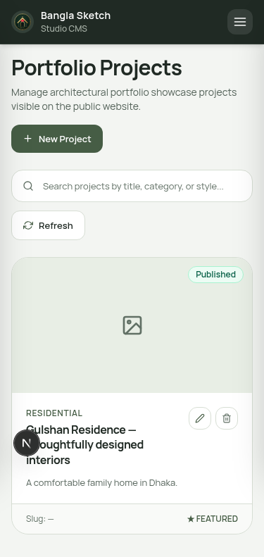

# Bangla Sketch

### বাংলা স্কেচ · Interior spaces with soul

Bangla Sketch is an interior design platform and content management system for a luxury design studio in Dhaka. It brings the public portfolio, editorial journal, lead capture, design assistant, and secure operations dashboard into one carefully crafted experience.



<p align="center"><a href="#highlights">Highlights</a> · <a href="#screenshots">Screenshots</a> · <a href="#local-development">Run locally</a> · <a href="docs/DEPLOYMENT_GUIDE.md">Deployment guide</a></p>

## Highlights

| Public experience | Studio operations |
| --- | --- |
| Editorial portfolio with project detail pages | Secure admin dashboard with protected routes |
| Blog and design journal with SEO metadata | Projects, blog, videos, testimonials, and clients |
| Guided enquiry and design brief forms | Site-visit booking and availability management |
| Cost estimator and conversational design assistant | Media uploads, version history, restore, and trash |
| Responsive mobile-first layouts | Rate limits, audit trails, and database constraints |

The platform is designed for real enquiries: submissions are persisted safely, email work is processed asynchronously, and Cloudinary handles optimized project media.

## Screenshots

The public website and admin sign-in previews below were captured from the local development app on September 23, 2026, including the latest workspace branding.

### Public website



### Admin sign-in



### Admin panel

Earlier dashboard previews are retained below for reference.





## Technology

- **Frontend:** Next.js 15 App Router, React 19, TypeScript, Tailwind CSS, Framer Motion
- **Backend:** Django REST Framework, PostgreSQL, JWT authentication, Bcrypt
- **Media:** Cloudinary upload signatures with WebP/AVIF optimization
- **Operations:** PM2, Nginx, Gunicorn, cPanel-compatible Node runner

## Local development

### Requirements

- Node.js 22+
- Python 3.12+
- PostgreSQL

### Backend

```bash
cd django_backend
python3 -m venv .venv
source .venv/bin/activate
pip install -r requirements.txt
cp .env.example .env  # First setup only; preserve any existing .env
# Configure database and secrets in .env
python manage.py migrate
python manage.py setup_admin
python manage.py runserver 5000
```

### Frontend

```bash
cd frontend
cp .env.example .env.local  # First setup only; preserve existing configuration
# Set NODE_ENV=development, API_URL=http://127.0.0.1:5000
# and NEXT_PUBLIC_API_URL=http://127.0.0.1:5000 in .env.local
npm install
npm run dev
```

Open [localhost:3000](http://localhost:3000) for the public site and [localhost:3000/admin](http://localhost:3000/admin) for the CMS.

Keep both development servers running in separate terminals. Backend startup requires a reachable PostgreSQL database. Cloudinary and email features require their corresponding credentials.

For queued email delivery and scheduled publishing, run these in additional terminals from `django_backend` with the virtual environment activated:

```bash
python manage.py run_email_worker
python manage.py run_jobs
```

## Quality and security

- `npm test --prefix frontend` runs frontend regression coverage.
- `npm run lint --prefix frontend` checks the Next.js codebase.
- `npm run build --prefix frontend` creates the production bundle.
- `cd django_backend && .venv/bin/python manage.py check` checks Django configuration.
- See the [Django migration audit](docs/DJANGO_MIGRATION_AUDIT.md) for compatibility and readiness limitations.
- Admin sessions use secure, server-verified cookies and middleware route guards.
- Public lead endpoints use validation, honeypot checks, rate limiting, and durable database writes.
- Dynamic filters are parameterized and constrained by explicit allowlists.

## Production

```bash
cd frontend
npm run build
npm run start
```

```bash
cd django_backend
DJANGO_SETTINGS_MODULE=config.settings.production \
  .venv/bin/gunicorn config.wsgi:application \
  --bind 127.0.0.1:5000 --workers 3
```

Read the [deployment guide](docs/DEPLOYMENT_GUIDE.md), [backend operations guide](django_backend/README.md), and [hardening notes](docs/BACKEND_HARDENING.md) before deploying.

## Repository map

```text
frontend/        Next.js website and admin CMS
django_backend/  Django API, authentication, lead workflows
shared/          Shared service configuration
docs/            Architecture, deployment, and visual previews
```

## License

Private product source for Bangla Sketch. Contact the project owner before reusing brand assets, copy, or production data.
